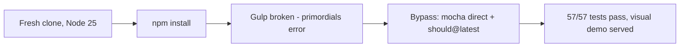

## What
- Installed deps via `npm install` (586 packages, old but functional)
- Upgraded `should` to latest (`npm install --save-dev should@latest`) for Node 25 compat
- Bypassed Gulp 3 entirely — run mocha directly with `--require should`
- Served visual demo via `npx http-server visual -p 8080 -c-1`

## Key Takeaways
- Gulp 3 is permanently broken on Node 12+ (`primordials` not defined). No fix without Node downgrade.
- `should@4.3.x` doesn't augment `Object.prototype` on modern Node. `should@latest` does.
- Visual demo is pure static HTML — no build step needed to serve it.

## Issues
- All `gulp` tasks nonfunctional (test, build, browserify bundle)
- No way to produce `pathfinding-browser.js` bundle without modern bundler or Node downgrade

## Decisions
- Chose mocha direct over installing nvm + old Node — simpler, no system changes
- Upgraded `should` in `devDependencies` rather than rewriting tests to different assertion lib

## Next
- Working commands:
  - Tests: `npx mocha --require should test/**/*.js`
  - Demo: `npx http-server visual -p 8080 -c-1`
- If browser bundle needed: add esbuild/webpack or install nvm + Node 11
