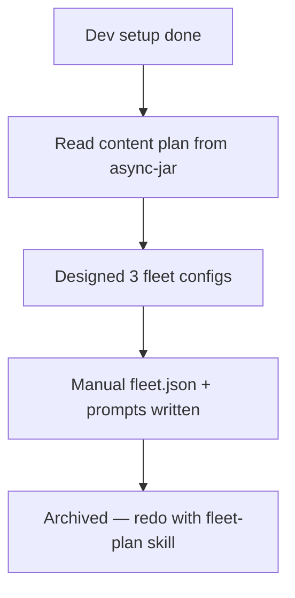

## What
- Dev setup complete: `npx mocha --require should test/**/*.js` (57/57), `npx http-server visual -p 8080 -c-1`
- Read master content plan: `~/async-jar/docs/experiments/003-fleet-demo-research/plans/02-claude-demo-content.md`
- Designed fleet configs for 3 demos through iterative conversation
- Manually wrote fleet.json + prompt.md files (18 workers total)
- Archived manual configs to `archive/` — plan is to regenerate using `fleet-plan` skill

## Key Takeaways

### Fleet Architecture (finalized in plan)
- **Demo 1: Test Coverage Blitz** — 1 dag-fleet, 9 workers, 4 layers
  - Layer 0: coverage-auditor + visual-auditor (parallel)
  - Layer 1: orchestrator (reads reports, writes assignments.md to each worker's input/ folder)
  - Layer 2: test-writer-1..4 + scenario-builder (read own assignments, empty = exit gracefully)
  - Layer 3: validator
- **Demo 2: Visual Scenario Builder** — 1 iterative-fleet, 6 workers
  - 5 builders (canvas, controls, scorer, persistence, integration) + 1 reviewer
  - Max 3 iterations, reviewer gates with lgtm/iterate
  - Fixed scope, no discovery needed
- **Demo 3: A* vs Dijkstra Showcase** — 1 dag-fleet, 3 workers
  - racer-astar + racer-dijkstra (parallel) → leaderboard
  - Fixed 15x15 map, fixed start/end, no optimization — just measure

### Key Design Decisions
- **TDD non-negotiable** — every worker writes failing tests first, frontend and backend
- **15x15 grid fixed** for all maps and scenarios
- **All outputs in markdown** — no JSON, more readable in tmux panes
- **Orchestrator as DAG worker** — reads auditor output, writes assignments to worker input/ dirs
- **Empty assignment = exit gracefully** — workers with nothing to do just exit 0
- **No inter-fleet triggering** — fleet skill doesn't support auto-chaining; solved by making Demo 1 a single dag-fleet with depends_on layers
- **Demo 2 has no discovery** — scope is fully defined (canvas, controls, scorer, persistence, integration)
- **Demo 3 has no optimization** — that's Demo 4's job
- **Scorer saves runs** — algorithm + map + metrics + timestamp, load for comparison, clear all

### Fleet Skill Capabilities (from exploration)
- dag-fleet: one-shot, DAG-ordered, `depends_on` for layering
- iterative-fleet: reviewer loop, `verdict: lgtm|iterate|escalate`, auto-injects feedback
- worktree-fleet: git branch isolation, independence validation
- Worker types: read-only, write, code-run, research, reviewer, orchestrator
- No auto inter-fleet triggering — fleets are isolated units
- Workers output to `{FLEET_ROOT}/workers/{id}/output/` (absolute paths)

## Issues
- Manual fleet configs may not align with launch script conventions — archived, redo with fleet-plan skill
- `{FLEET_ROOT}` placeholder in prompts needs to resolve to absolute path at launch time

## Decisions
- Archive manual work, regenerate with `fleet-plan` skill for proper alignment with fleet launch scripts
- Plan file (`plans/02-fleet-configs.md`) stays as source of truth for fleet-plan to consume

## Next
1. Use `fleet-plan` skill to generate fleet configs from `plans/02-fleet-configs.md`
2. Also reference master content plan: `~/async-jar/docs/experiments/003-fleet-demo-research/plans/02-claude-demo-content.md`
3. Validate generated configs against fleet launch scripts
4. Launch Demo 1 first, then Demo 2, then Demo 3 sequentially
5. Key files:
   - Plan: `docs/experiments/001-demo-artifacts/plans/02-fleet-configs.md`
   - Archive: `docs/experiments/001-demo-artifacts/archive/`
   - Content plan: `~/async-jar/docs/experiments/003-fleet-demo-research/plans/02-claude-demo-content.md`
   - Fleet skill: `~/skills-test/skills/fleet/`
