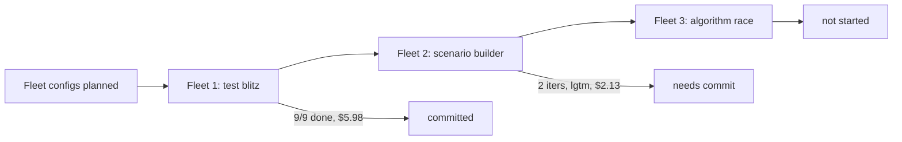

## What
- Fleet 01 (dag-fleet, test-blitz): 9 workers, 4 layers, all completed. Added 6 new test files, minor source fixes. $5.98 total. Committed as `dc50c9b`.
- Fleet 02 (iterative-fleet, scenario-builder): 6 workers (5 builders + 1 reviewer). LGTM on iteration 2. $2.13 total. Not yet committed.
- Fleet 03 (dag-fleet, algorithm-race): not started yet.

## Key Takeaways
- Iterative fleet reviewer MUST be told where to write verdict file (`iterations/<N>/review.md` relative to fleet root)
- Reviewer must discover iteration number by listing `iterations/` dir — orchestrator only injects iteration number for iter 2+
- Worker prompts should be minimal — just what to build and how. No file ownership, no absolute paths, no spoon-feeding. Workers discover codebase themselves.
- Fleet 01 ran clean first try. Fleet 02 took 3 launch attempts due to: (1) reviewer not writing verdict, (2) trailing comma in fleet.json from bad sed cleanup

## Issues
- Reviewer prompt originally didn't specify verdict file path → orchestrator backfilled empty "iterate" → wasted iteration 1
- `sed` used to strip status fields from fleet.json left trailing comma → JSON parse error on relaunch
- Fleet 02 workers all edit shared files (visual/index.html etc) — no conflicts observed but risky with more workers

## Decisions
- Kept worker prompts generic: just task description + TDD instructions. No file ownership rules.
- Updated `instructions-fleet.md` with reviewer verdict convention and lessons learned
- All workers $10 budget, sonnet for builders, opus for reviewer/validator/orchestrator

## Next
1. Commit fleet 02 results
2. Launch fleet 03 (algorithm race) — simple dag-fleet, 3 workers
3. After fleet 03: verify visual demo works end-to-end, run full test suite
4. Launch commands ready in `instructions-fleet.md`
