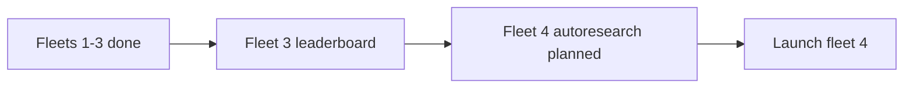

## What
- Fleet 03 results reviewed: A* vs Dijkstra on two maps
  - Sparse: A* 91/121 nodes, Dijkstra 203 nodes. A* wins ~40% fewer nodes.
  - Spiral: Both 131 nodes, tied. Dijkstra slightly faster (no heuristic overhead).
- Fleet 04 (autoresearch) planned and ready to launch
  - Karpathy-style autonomous loop: edit → eval → keep/discard → repeat
  - Metric: Dijkstra/A* node ratio on sparse map. Baseline: 1.68. Goal: minimize toward 1.0.
  - Eval script: `bench-dijkstra.js` — runs both algorithms on fixed sparse map, outputs ratio
  - Mutable file: `src/finders/DijkstraFinder.js`
  - Plateau search enabled after 3 consecutive discards

## Key Takeaways
- Dijkstra is literally A* with `heuristic = 0` (19-line file extending AStarFinder)
- Sparse map: 15x15, 22 wall cells, start (0,0) → end (14,14)
- Node count discrepancy between fleet 3 racers (91) and bench script (121) — different counting method (opened||closed vs just closed). Consistent within bench, doesn't matter.
- Spiral map already tied — no optimization needed there

## Issues
- None. Fleet 04 config + program.md + eval script all written and tested.

## Decisions
- Autoresearch fleet (not iterative/dag) — single metric, single file, autonomous iteration
- Sparse map only for eval — that's where the gap is. Spiral already 1:1.
- $5/iter budget, 20 max iterations, $50 cost cap
- Sonnet model (not opus) — code changes are focused, don't need heavy reasoning
- Correctness guard in bench: crashes if Dijkstra path is suboptimal

## Next
1. Launch fleet 04:
   ```
   bash /home/sagar/.claude/skills/autoresearch-fleet/scripts/launch.sh /home/sagar/PathFinding.js-fork/docs/experiments/001-demo-artifacts/fleets/fleet-04-dijkstra-optimize
   ```
2. Monitor:
   ```
   bash /home/sagar/.claude/skills/autoresearch-fleet/scripts/status.sh /home/sagar/PathFinding.js-fork/docs/experiments/001-demo-artifacts/fleets/fleet-04-dijkstra-optimize
   ```
3. After fleet 04: integrate best Dijkstra into scenario builder as selectable algorithm
4. Key files:
   - `src/finders/DijkstraFinder.js` — mutable target
   - `src/finders/AStarFinder.js` — DO NOT MODIFY (baseline)
   - `bench-dijkstra.js` — eval harness (DO NOT MODIFY)
   - Fleet root: `docs/experiments/001-demo-artifacts/fleets/fleet-04-dijkstra-optimize/`
