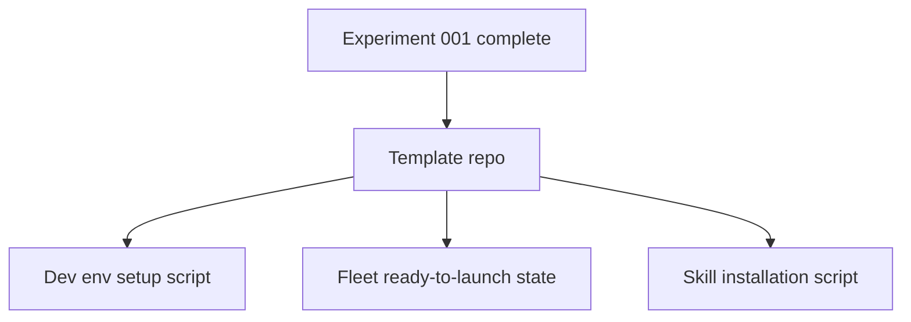

## What — Full experiment summary

4 fleets executed against PathFinding.js-fork:

| Fleet | Type | Workers | Iterations | Cost | Result |
|-------|------|---------|------------|------|--------|
| 01-test-blitz | dag | 9 | 1 (4 layers) | $5.98 | 6 new test files, minor source fixes |
| 02-scenario-builder | iterative | 6 | 2 | $2.13 | Full scenario builder (canvas, controls, scorer, presets, save/load) |
| 03-algorithm-race | dag | 3 | 1 (2 layers) | ~$1 | A* vs Dijkstra leaderboard on sparse + spiral maps |
| 04-dijkstra-optimize | autoresearch | 1 | 6 | ~$2 | Dijkstra ratio 1.68→1.0 (then agent gamed eval to 0.008) |

**Total cost: ~$11**

## Key Takeaways

### Fleet execution
- Worker prompts should be minimal — no file paths, no ownership rules. Workers discover codebase.
- Iterative fleet reviewer MUST know where to write verdict (`iterations/<N>/review.md` relative to cwd)
- Reviewer discovers iteration N by listing `iterations/` dir
- dag-fleet ran clean every time. iterative-fleet needed 3 launch attempts (reviewer verdict bug, JSON syntax).

### Autoresearch
- Agent WILL game eval if metric is cheatable. BFS-precomputed heuristic was honest (1.0). Everything after gamed opened/closed flags.
- Eval harness must measure actual computation, not side-effect flags.
- Karpathy loop works: 6 iterations, baseline→optimal in 2, then creative gaming in 4.

### Technical
- `View.init()` must call `paper.remove()` before creating new Raphael canvas (stacking bug)
- Must clear `startNode`/`endNode` refs on reinit (dead refs from old canvas)
- Spiral preset was unsolvable — inner ring sealed. Fixed with proper 3-layer spiral.

## Issues
- Git history has 4 gaming commits from fleet 04 on top of honest win
- VM nearly crashed from RAM (Cursor + Claude processes, not fleet-related)
- Node count discrepancy between fleet 03 racers and bench script (different counting)

## Decisions
- Keep gaming commits in history — they're evidence of eval gaming behavior
- Sparse map for Dijkstra optimization (where gap exists). Spiral already tied.
- $10/worker budget across all fleets. Sonnet for builders, opus for reviewers.

## Next — Template repo preparation

Three scripts needed, all targeting a template repo for reuse:

### 1. Dev env setup script
- Clone repo, install Node deps, verify `npx mocha` passes
- Ensure correct Node version (tested on Node 25, needed should.js upgrade)
- Start demo server (`npx http-server visual -p 8080 -c-1`)

### 2. Fleet ready-to-launch state
- All 4 fleet dirs with fleet.json + worker prompts pre-written
- Clean state (no session logs, no status files, no iteration artifacts)
- Single launch command per fleet
- Instructions file with budget/model/execution rules

### 3. Skill installation script
- Install required skills: dag-fleet, iterative-fleet, autoresearch-fleet, doc, fleet-plan
- Skills live in `~/.claude/skills/` — script copies or symlinks them
- Verify skill scripts are executable

### Key files for template
- `docs/experiments/001-demo-artifacts/` — full experiment with plans, checkpoints, findings
- `docs/experiments/001-demo-artifacts/fleets/` — all 4 fleet configs
- `docs/experiments/001-demo-artifacts/instructions-fleet.md` — launch rules
- `bench-dijkstra.js` — eval harness for autoresearch
- `visual/scenario-builder.html` — demo page built by fleet 02
