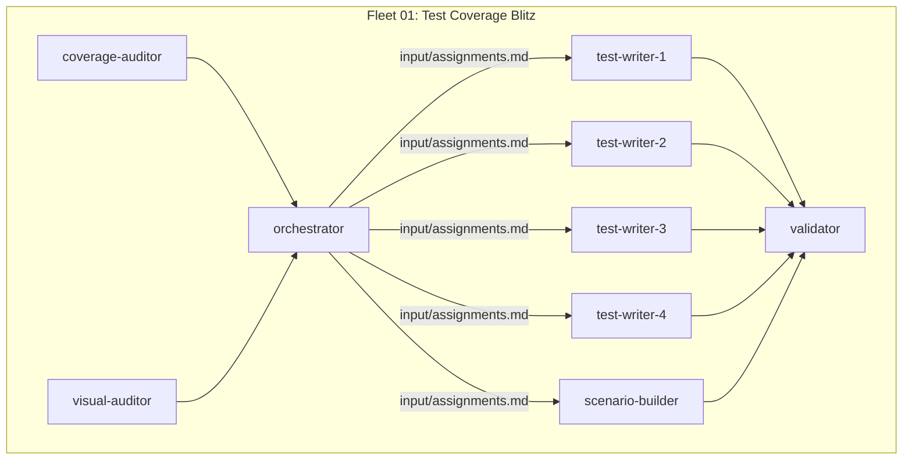
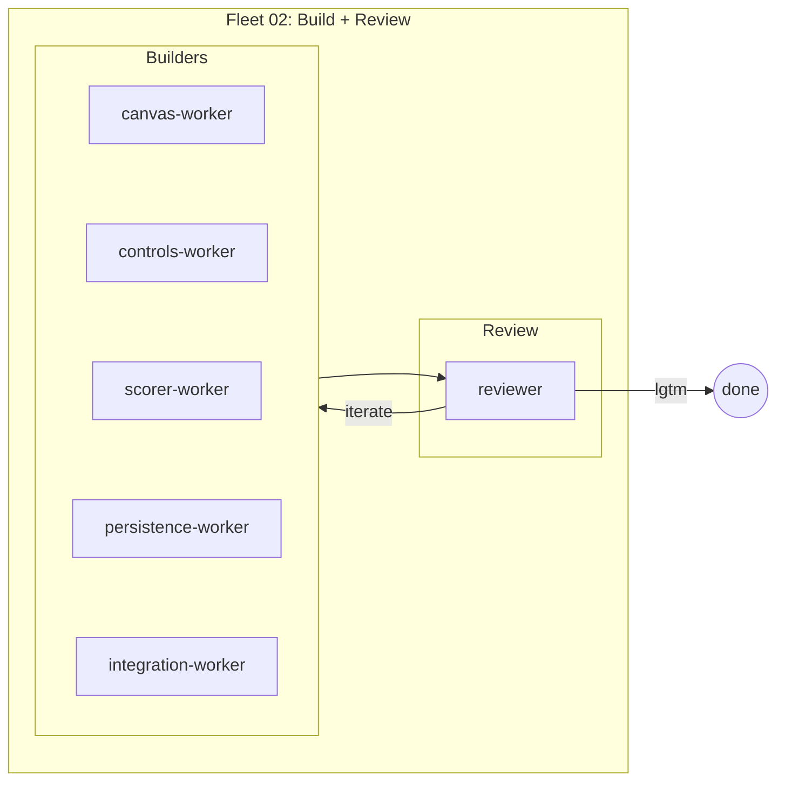
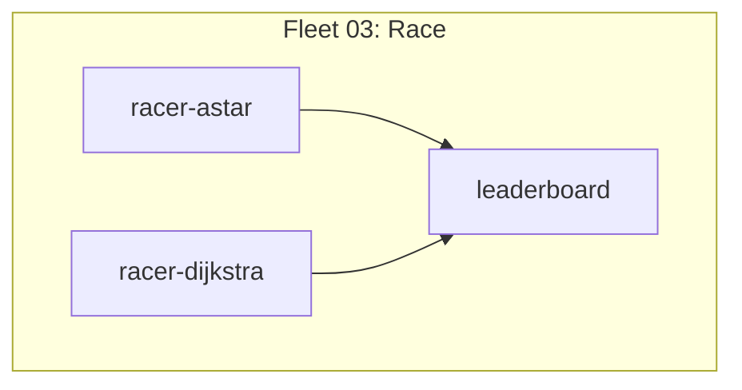

# Fleet Configs — Demos 1, 2, 3

Repo: `~/PathFinding.js-fork`
Test cmd: `npx mocha --require should test/**/*.js`
Demo server: `npx http-server visual -p 8080 -c-1`

All outputs in markdown. All fleets self-contained — one fleet per demo.

---

## Demo 1: Test Coverage Blitz



### Fleet 01: Test Coverage Blitz (dag-fleet)

**Goal:** Audit gaps, distribute work, write tests, build scenario tooling, validate. Single fleet, 4 layers.

```
Layer 0 (parallel):
  coverage-auditor    → run tests, analyze coverage per algorithm
                        output: output/gap-report.md
  visual-auditor      → analyze visual/ app capabilities + gaps
                        output: output/visual-gaps.md

Layer 1 (depends_on: coverage-auditor, visual-auditor):
  orchestrator        → reads both reports, distributes gaps across 4 writers
                        writes: workers/test-writer-{1..4}/input/assignments.md
                        writes: workers/scenario-builder/input/assignments.md
                        empty assignment = "no work needed, exit gracefully"

Layer 2 (depends_on: orchestrator, parallel):
  test-writer-1       → reads own input/assignments.md, writes tests for assigned gaps
  test-writer-2       → reads own input/assignments.md, writes tests for assigned gaps
  test-writer-3       → reads own input/assignments.md, writes tests for assigned gaps
  test-writer-4       → reads own input/assignments.md, writes tests for assigned gaps
                        (empty assignment → exit 0)
  scenario-builder    → reads own input/assignments.md, builds visual features

Layer 3 (depends_on: all Layer 2):
  validator           → run full suite, report before/after, verify scenario builder
```

**Workers:** 9 (2 auditors + 1 orchestrator + 4 test writers + 1 builder + 1 validator)
**Type:** dag-fleet
**Name:** `fleet-01-test-blitz`

---

## Demo 2: Visual Scenario Builder



### Fleet 02: Scenario Builder (iterative-fleet)

**Goal:** Build interactive map editor + scorer + comparison drawer. Fixed scope, no discovery. Reviewer runs Demo 1's tests as regression check.

```
Workers (parallel, iterative with reviewer):
  canvas-worker       → grid rendering, click-to-toggle-wall, start/end placement
                        (walls = dark, start = green, end = red)
  controls-worker     → algorithm dropdown, "find path" button, "clear" button,
                        grid size selector, speed slider
  scorer-worker       → capture metrics (nodes explored, path length, time ms),
                        score card display, comparison drawer (side-by-side runs),
                        save run (algorithm + map + metrics + timestamp),
                        load saved runs for comparison, clear all saved runs
  persistence-worker  → save/load scenario as JSON, preset map library
                        (3-5 built-in: empty, maze, spiral, bottleneck, random)
                        ALL maps fixed 15x15 grid
  integration-worker  → wire canvas + controls + scorer + persistence,
                        hook "find path" to pathfinding, animate path step-by-step
  reviewer            → verify: draw walls? place start/end? save/load scenario?
                        animate? scorer shows metrics? save a run? load saved
                        runs for comparison? clear all saved runs? comparison
                        drawer works?
                        run: npx mocha --require should test/**/*.js
                        verdict: lgtm or iterate
```

**Workers:** 6 (5 builders + 1 reviewer)
**Type:** iterative-fleet, max 3 iterations
**Name:** `fleet-02-scenario-builder`

---

## Demo 3: A* vs Dijkstra Showcase



### Fleet 03: Race (dag-fleet)

**Goal:** Run A* and Dijkstra on a fixed map with fixed start/end. Capture metrics (nodes explored, path length, time). Output leaderboard. No discovery, no optimization — just measure and show A* wins.

```
Workers (parallel):
  racer-astar         → run A* on fixed map, capture metrics, output results.md
  racer-dijkstra      → run Dijkstra on same map, capture metrics, output results.md

Depends on both:
  leaderboard         → read both results, produce leaderboard.md + terminal output
                        (optionally feed to visual canvas comparison if Demo 2 built it)
```

**Workers:** 3 (2 racers → 1 leaderboard)
**Type:** dag-fleet
**Name:** `fleet-03-algorithm-race`
**Fixed inputs:** 15x15 grid, one map with sparse walls, same start/end for both

---

## Naming Convention

| Fleet | Dir | Type | Workers |
|-------|-----|------|---------|
| fleet-01-test-blitz | `fleets/fleet-01-test-blitz/` | dag | 9 |
| fleet-02-scenario-builder | `fleets/fleet-02-scenario-builder/` | iterative | 6 |
| fleet-03-algorithm-race | `fleets/fleet-03-algorithm-race/` | dag | 3 |

## TDD Approach (ALL fleets, ALL workers — frontend and backend)

**Non-negotiable: every worker writes failing tests first, then implements.**

This applies to:
- Backend: algorithm tests, benchmark tests, utility tests
- Frontend: UI component tests, interaction tests, save/load tests, scorer tests
- Integration: end-to-end wiring tests

Workers receive their assignment, then:
1. Read assigned code + existing tests
2. Write failing tests first (even for UI — test the behavior, not the pixels)
3. Implement until tests pass
4. Verify existing tests still green: `npx mocha --require should test/**/*.js`
5. If no assignment → log "no work needed" and exit 0
